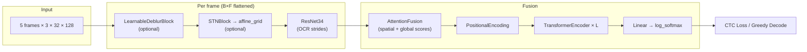

# MultiFrame-LPR — Project Context (AI Assistant)

> **Mục đích file này:** Gắn vào chat/context khi nhờ AI hỗ trợ train, debug, hoặc mở rộng pipeline.
> **Challenge:** [ICPR 2026 LRLPR](https://icpr26lrlpr.github.io/) — Low-Resolution License Plate Recognition (biển số mờ / độ phân giải thấp).

---

## 1. Tổng quan

Dự án nhận diện ký tự biển số xe từ **chuỗi 5 frame video** (multi-frame OCR). Mỗi track là một xe đi qua camera; mỗi frame là crop biển số độ phân giải thấp (`lr-*.png`).

**Model chính:** `ResTranOCR` = ResNet34 backbone + Attention Fusion (5 frame) + Transformer Encoder + **CTC** decoding.

**Hai lớp xử lý ảnh mờ (SR):**
| Lớp | Vị trí | Loại | Flag config |
|-----|--------|------|-------------|
| Preprocessing SR | DataLoader (`dataset.py`) | OpenCV: upscale → CLAHE/sharpen → downscale | `USE_SR`, `SR_SCALE` |
| Learnable Deblur | Trong model, trước STN | CNN residual block, train end-to-end | `USE_LEARNABLE_SR` |

**Căn chỉnh không gian:** `STNBlock` (Spatial Transformer Network) — affine transform trước backbone.

---

## 2. Kiến trúc model



### Thành phần (`src/models/`)

| Module | File | Vai trò |
|--------|------|---------|
| `ResTranOCR` | `restran.py` | Orchestrator toàn pipeline |
| `LearnableDeblurBlock` | `components.py` | 3×Conv residual, `x + net(x)`, trước STN |
| `STNBlock` | `components.py` | Localization CNN → θ (2×3 affine), init identity |
| `ResNetFeatureExtractor` | `components.py` | ResNet34, stride `(2,1)` ở layer3/4, pool height → 1 |
| `AttentionFusion` | `components.py` | Softmax weight theo frame (spatial + global quality) |
| `PositionalEncoding` | `components.py` | Sinusoidal PE cho sequence width |
| CTC Head | `restran.py` | `Linear(512, num_classes)` |

**Tensor shapes:**
- Input: `[B, 5, 3, H, W]` — mặc định `H=32, W=128`
- Sau backbone mỗi frame: `[B*5, 512, 1, W']` (~W' ≈ W/2)
- Sau fusion: `[B, 512, 1, W']` → Transformer: `[B, W', 512]`
- Output: `[B, W', num_classes]` log-softmax

**Character set:** `0-9`, `A-Z` (36 ký tự) + blank (index 0) → `NUM_CLASSES = 37`.

---

## 3. Pipeline dữ liệu

### Cấu trúc thư mục

```
dataset/data/train/
├── Scenario-A/.../track_XXXXX/
│   ├── lr-001.png … lr-005.png    # 5 frame LR (bắt buộc)
│   ├── hr-001.png …               # HR (optional, cho synthetic LR)
│   └── annotations.json           # {"plate_text": "ABC1234", ...}
└── Scenario-B/.../                 # Mercosur, Brazil, v.v.
```

Test public: `dataset/Pa7a3Hin-test-public/.../track_*/lr-*.png` (không có label).

### Mỗi `__getitem__` (train/val/test)

```
Đọc ảnh BGR → RGB
  → [train + synthetic] degradation (blur, noise, JPEG, downscale)
  → resize → (128, 32) bicubic
  → [USE_SR] apply_lightweight_sr (upscale SR_SCALE× → enhance → downscale về 32×128)
  → albumentations (train: affine/perspective/color/dropout; val/test: normalize only)
  → stack 5 frames → tensor [5, 3, 32, 128]
```

**Hai loại sample trong train:**
1. **Real LR** — dùng `lr-*.png` trực tiếp.
2. **Synthetic LR** — dùng `hr-*.png` + `get_degradation_transforms()` mô phỏng mờ.

Mỗi track tạo **2 sample** khi train (real + synthetic) → dataset train ~ gấp đôi số track.

### Validation split

- File cố định: `dataset/data/val_tracks.json` (danh sách `track_*` ID).
- Val **ưu tiên lấy từ Scenario-B** (gần test distribution hơn).
- `--submission-mode` / `full_train=True`: train trên **toàn bộ** data, không val.

---

## 4. Training

### Entry point: `train.py`

```bash
# Train mặc định (STN + SR preprocessing + Learnable Deblur + pretrained ResNet34)
python train.py --epochs 30 --experiment-name my_exp

# Tắt từng thành phần (ablation)
python train.py --no-stn
python train.py --no-sr
python train.py --no-learnable-sr
python train.py --no-pretrained

# Train full data + inference test → submission
python train.py --submission-mode --epochs 30
```

### Inference: `predict.py`

```bash
python predict.py --checkpoint results/my_exp_best.pth --mode test
python predict.py --checkpoint results/my_exp_best.pth --mode val

# Flags phải khớp lúc train:
python predict.py --checkpoint ... --no-stn --no-sr --no-learnable-sr
```

### Trainer (`src/training/trainer.py`)

- **Loss:** `CTCLoss(blank=0)`
- **Optimizer:** AdamW + weight decay
- **Scheduler:** OneCycleLR (step mỗi batch)
- **AMP:** `autocast` + `GradScaler`
- **Grad clip:** 5.0
- **Metric val:** exact match accuracy (chuỗi pred == GT)
- **Checkpoint:** `{OUTPUT_DIR}/{EXPERIMENT_NAME}_best.pth` (theo val acc cao nhất)
- **Submission format:** `track_id,predicted_text;confidence`

### Decode (`src/utils/postprocess.py`)

Greedy CTC: group consecutive identical indices, bỏ blank, confidence = mean max-prob mỗi ký tự.

---

## 5. Config quan trọng (`configs/config.py`)

```python
EXPERIMENT_NAME = "restran34_with_stn"
USE_STN = True
USE_SR = True                    # OpenCV preprocessing SR
USE_LEARNABLE_SR = True          # LearnableDeblurBlock trong model
SR_SCALE = 2                       # Hệ số upscale nội bộ trong preprocessing SR
USE_PRETRAINED_BACKBONE = True

IMG_HEIGHT, IMG_WIDTH = 32, 128
BATCH_SIZE = 64
LEARNING_RATE = 4e-4
EPOCHS = 1                         # Đổi lên 30+ khi train thật
AUGMENTATION_LEVEL = "full"        # "full" | "light"

TRANSFORMER_HEADS = 8
TRANSFORMER_LAYERS = 3
TRANSFORMER_FF_DIM = 2048
TRANSFORMER_DROPOUT = 0.1

DATA_ROOT = "dataset/data/train"
TEST_DATA_ROOT = "dataset/Pa7a3Hin-test-public/Pa7a3Hin-test-public"
VAL_SPLIT_FILE = "dataset/data/val_tracks.json"
OUTPUT_DIR = "results"
```

---

## 6. Cấu trúc source code

```
MultiFrame-LPR/
├── configs/config.py          # Hyperparameters & flags
├── train.py                   # Train CLI
├── predict.py                 # Inference CLI
├── run_ablation.py            # So sánh with/without STN
├── PROJECT_CONTEXT.md         # File này
├── SR_CHANGELOG_AND_USAGE.md  # Ghi chú tích hợp SR (có thể lỗi thời một phần)
├── src/
│   ├── data/
│   │   ├── dataset.py         # MultiFrameDataset, split, indexing
│   │   └── transforms.py      # Augmentation, degradation, SR preprocessing
│   ├── models/
│   │   ├── restran.py         # ResTranOCR
│   │   └── components.py      # STN, Deblur, ResNet, Fusion, PE
│   ├── training/trainer.py    # Train/val/predict loop
│   └── utils/
│       ├── common.py          # seed_everything
│       └── postprocess.py     # CTC decode
├── dataset/                   # Data (không commit đầy đủ)
└── results/                   # Checkpoints & submissions
```

---

## 7. Quyết định thiết kế & lưu ý

### Tại sao 2 lớp SR?

- **Preprocessing SR (OpenCV):** Nhanh, deterministic, không tăng params model; phục hồi edge trước khi vào network.
- **Learnable Deblur:** Học cách deblur phù hợp task OCR; đặt **trước STN** để STN thấy biên ký tự rõ hơn.

### STN

Init identity transform → model bắt đầu như không transform, học dần. Tắt bằng `--no-stn` khi ablation.

### Multi-frame fusion

Không simple average — dùng attention có **spatial score** (per-pixel) + **global frame quality** → frame nét hơn được weight cao hơn (phù hợp LRLPR).

### Synthetic LR từ HR

Tăng diversity blur/noise/compression; chỉ áp dụng khi `mode='train'` và sample `is_synthetic=True`.

### Khi load checkpoint

Architecture flags (`USE_STN`, `USE_LEARNABLE_SR`, `USE_PRETRAINED_BACKBONE`) phải **khớp** lúc train. `USE_SR` chỉ ảnh hưởng preprocessing, không ảnh hưởng `state_dict` keys.

---

## 8. Kế hoạch thí nghiệm gợi ý

| # | Cấu hình | Mục đích |
|---|----------|----------|
| 1 | `--no-sr --no-learnable-sr` | Baseline thuần ResTran+STN |
| 2 | `--no-learnable-sr` | Chỉ OpenCV SR |
| 3 | `--no-sr` | Chỉ learnable deblur |
| 4 | default (cả hai SR) | Full pipeline |
| 5 | `--no-stn` | Đo contribution STN |
| 6 | `--aug-level light` | Ít augmentation hơn |

Chạy ablation STN tự động: `python run_ablation.py` (chưa bao gồm ablation SR).

---

## 9. Cải thiện đã / có thể làm tiếp

**Đã sửa (2025-06):** `apply_lightweight_sr` trước đây upscale lên `64×256` nhưng **không downscale lại** → input model lệch so với `IMG_HEIGHT/WIDTH`. Đã sửa: upscale → enhance → downscale về kích thước gốc.

**Có thể cải thiện thêm:**
- Mở rộng `run_ablation.py` cho SR / learnable SR.
- Thêm CER (Character Error Rate) ngoài exact accuracy trong trainer.
- Curriculum: tăng dần degradation strength theo epoch.
- Thử `torch.compile` / `USE_CUDNN_BENCHMARK=True` khi đã ổn định seed.
- Frame selection nếu track có >5 frame (hiện dùng tất cả file `lr-*` sorted).
- EMA weights cho checkpoint tốt hơn.

---

## 10. Lệnh nhanh cho AI assistant

Khi paste context, có thể thêm yêu cầu cụ thể:

```
Đọc PROJECT_CONTEXT.md. Tôi đang train ICPR 2026 LRLPR với ResTranOCR.
Hiện tại val acc ~X%. Hãy giúp [debug loss / tối ưu SR / thêm augmentation / ...].
Checkpoint: results/xxx_best.pth. Config: USE_STN=True, USE_SR=True, USE_LEARNABLE_SR=True.
```

---

## 11. Dependencies

- Python 3.11+, PyTorch 2.9+, torchvision, albumentations, opencv-python, tqdm
- Cài: `uv sync` hoặc `pip install -r requirements.txt` (+ PyTorch CUDA phù hợp GPU)
